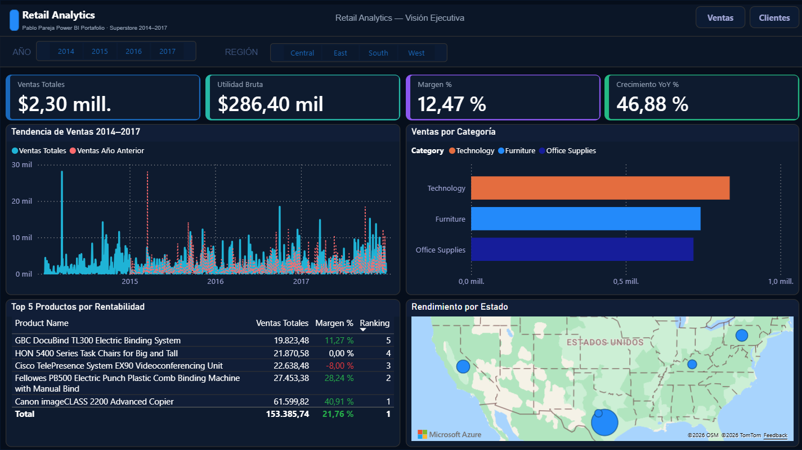
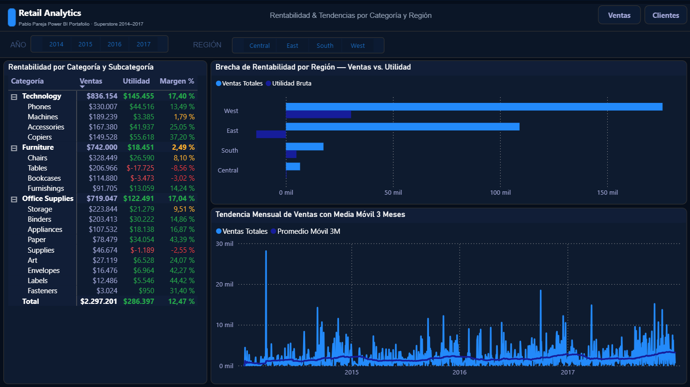
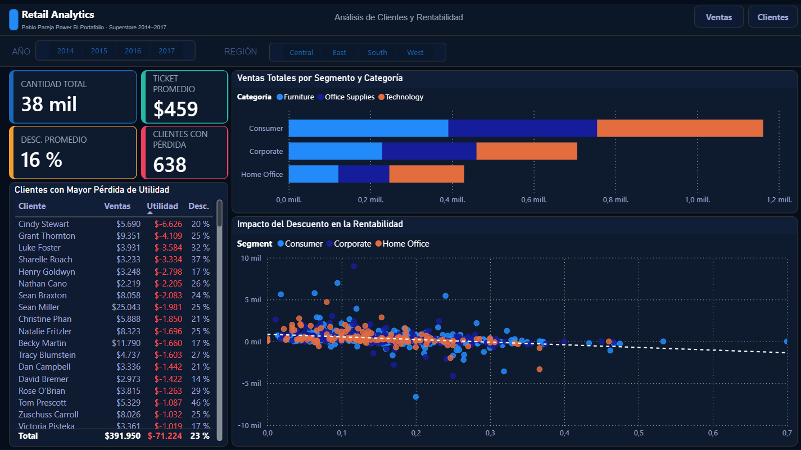

# 🏪 Retail Analytics — Dashboard Ejecutivo Power BI


## 📌 Descripción

Dashboard ejecutivo retail construido en Power BI como proyecto de portafolio 
para la certificación **Microsoft PL-300 Power BI Data Analyst**.

Analiza ~10,000 transacciones de una cadena retail (2014–2017) respondiendo 
preguntas críticas de negocio sobre ventas, rentabilidad y comportamiento de clientes.

---

## 🖼️ Vista previa

### Resumen Ejecutivo


### Análisis de Ventas


### Análisis de Clientes


---

## 🎯 Preguntas de negocio respondidas

- ¿Cuánto vendimos y cuánto ganamos realmente?
- ¿Estamos creciendo respecto al año anterior?
- ¿Qué categorías y productos tienen margen negativo?
- ¿Qué clientes generan pérdidas a pesar de comprar mucho?
- ¿El descuento está destruyendo nuestra rentabilidad?

---

## 🏗️ Arquitectura técnica

| Capa | Detalle |
|---|---|
| Fuente de datos | Kaggle Superstore Dataset · 9,994 filas |
| Transformación | Power Query · limpieza · columnas calculadas |
| Modelado | Modelo estrella · 1 tabla hechos + 4 dimensiones |
| Cálculo | DAX avanzado · 12 medidas · time intelligence |
| Seguridad | Row Level Security · 3 roles por región |
| Visualización | 3 páginas · bookmarks · slicers sincronizados |

---

## 🗂️ Modelo de datos

| Tabla | Tipo | Conecta con |
|---|---|---|
| FactVentas | Tabla de hechos | DimCliente, DimProducto, DimRegion, DimCalendario |
| DimCliente | Dimensión | FactVentas |
| DimProducto | Dimensión | FactVentas |
| DimRegion | Dimensión | FactVentas |
| DimCalendario | Dimensión | FactVentas |

> Diseño en estrella con filtros unidireccionales — las dimensiones filtran hacia FactVentas.

---

## 🔑 Medidas DAX destacadas

```dax
-- Crecimiento año sobre año
Crecimiento YoY % = 
DIVIDE(
    [Ventas Totales] - [Ventas Año Anterior],
    [Ventas Año Anterior],
    0
)

-- Promedio móvil 3 meses
Promedio Móvil 3M = 
AVERAGEX(
    DATESINPERIOD(
        DimCalendario[Date],
        LASTDATE(DimCalendario[Date]),
        -3, MONTH
    ),
    [Ventas Totales]
)
```

---

## 💎 Hallazgos clave

> 📉 **Furniture tiene margen crítico del 2.49%** — Tables (-8.56%) y 
> Bookcases (-3.02%) generan pérdidas activas

> ⚠️ **Descuentos sobre 40% destruyen rentabilidad** en el 78% de los casos

> 🔴 **638 registros de clientes con pérdida neta** — impactan directamente 
> el margen del negocio

> ✅ **Technology lidera con 17.4% de margen** — Copiers al 37.2%

> 📈 **Crecimiento YoY del 46.88%** impulsado por Q4

---

## 🔐 Row Level Security

| Rol | Acceso |
|---|---|
| Gerente_Norte | Solo región Central |
| Gerente_Sur | Solo región South |
| Gerente_Oeste | Solo región West |

---

## 🛠️ Tecnologías utilizadas

- Microsoft Power BI Desktop
- DAX (Data Analysis Expressions)
- Power Query (M Language)
- Dataset: Kaggle Superstore Sales

---

## 👤 Autor

**Pablo** · Analista de Datos  
📜 Certificación: Coursera Microsoft PL-300 Power BI Data Analyst  
🔗 LinkedIn: [https://www.linkedin.com/in/ppareja/]

---

## 📁 Estructura del repositorio

| Carpeta | Archivo | Descripción |
|---|---|---|
| `data/` | `superstore.csv` | Dataset original Kaggle Superstore |
| `pbix/` | `RetailAnalytics.pbix` | Archivo Power BI Desktop |
| `screenshots/` | `01_resumen_ejecutivo.png` | Captura Página 1 |
| `screenshots/` | `02_analisis_ventas.png` | Captura Página 2 |
| `screenshots/` | `03_analisis_clientes.png` | Captura Página 3 |
| `/` | `README.md` | Documentación del proyecto |
